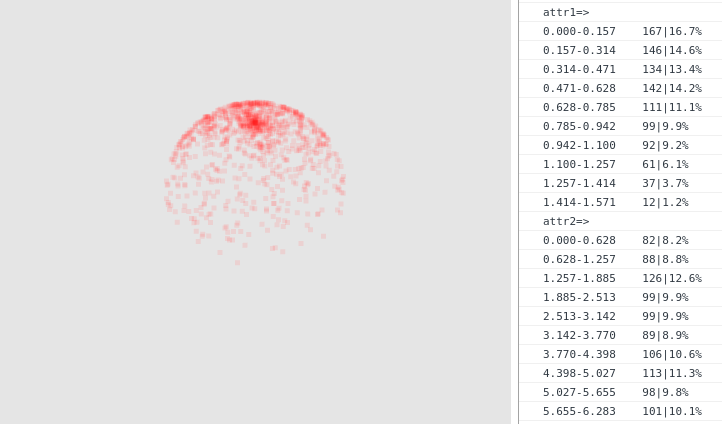

# Sampler
just a sampler

Sampler是一个取样调试工具,可以通过图形化取样结果，并计算出各个分布区间的取样个数和取样概率



## 使用之前

Sampler脚本文件在`\bin`路径下，在引用它之前记得先引用sylvester.js库，你可以在`\test`路径下找到它

## 快速开始

```js
let canvas = document.getElementById('canvas');

let renderer = new $S.Renderer(canvas);
let sampler = new $S.Sampler('cosineWeightedDirection',$V([0,1,0]));
let print = false;

function tick(){
    requestAnimationFrame(tick);
    renderer.render(sampler.sampleDatas);
    if(sampler.sampleNum>1000){
        if(!print) {
            sampler.print();
            print = !print;
        }
        return;
    }
    sampler.sampling();
}

tick();
```

上面这段样例代码非常的简单，你只需要通过`$S.Renderer`创建一个渲染器，通过`$S.Sampler`创建一个取样器即可，并在渲染循环中不断调用取样器的`sampling`函数进行取样，并将取样点交到渲染器中渲染即可。
当然，在运行代码之前不要忘记确认你的浏览器支持webgl！

## 写你自己的取样函数

```js
function power(n){
    return {
        f: () => {
            let sample = [];
            for(let i=0;i<n+1;i++){
                sample.push(Math.random())
            }
            let max = Math.max(...sample);
            return {
                data: $V([max, 0, 0]),
                x: [max]
            };
        },
        type: 1,
        range: [[0, 1]]
    }
}
```

如上是一个以幂函数形式的概率函数取样的取样函数，需要注意的是返回值的格式问题：

1. power返回值中，f是取样器每次调用sampling时都会调用一次的函数，用来获得取样点
2. f函数返回值中，data指返回的取样点，类型是sylvester中的向量类型
3. f函数返回值中，x指取样事件，用来统计取样分布
4. power函数返回值中，type是事件的维数
5. power函数返回值中，range是事件的范围，range[x][0]即为x事件的下限，range[x][1]即为x事件的上限

## API

Renderer 渲染器

<table>
    <tr>
        <td>函数名</td>
        <td>参数</td>
        <td>说明</td>
    </tr>
    <tr>
        <td>constructor</td>
        <td>(canvas)</td>
        <td>结构体<br>@canvas 画布元素</td>
    </tr>
    <tr>
        <td>render</td>
        <td>(samplerResult)</td>
        <td>@samplerResult 取样器取样函数的返回结果</td>
    </tr>
</table>

Sampler 取样器

<table>
    <tr>
        <td>属性名</td>
        <td>类型</td>
        <td>说明</td>
    </tr>
    <tr>
        <td>sampleNum</td>
        <td>int</td>
        <td>取样数</td>
    </tr>
    <tr>
        <td>divide</td>
        <td>int</td>
        <td>分布区间划分数目</td>
    </tr>
    <tr>
        <td>函数名</td>
        <td>参数</td>
        <td>说明</td>
    </tr>
    <tr>
        <td>constructor</td>
        <td>(name,...attr)</td>
        <td>结构体<br>@name 取样函数名<br>@attr 取样函数参数</td>
    </tr>
    <tr>
        <td>addSampler</td>
        <td>(name,f)</td>
        <td>添加一个取样函数<br>@name 函数名<br>@f 函数体</td>
    </tr>
    <tr>
        <td>sampling</td>
        <td></td>
        <td>执行取样函数，返回取样结果</td>
    </tr>
    <tr>
        <td>print</td>
        <td></td>
        <td>打印各个分布区间的<br>取样个数和取样概率</td>
    </tr>
</table>